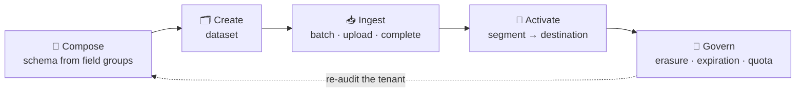
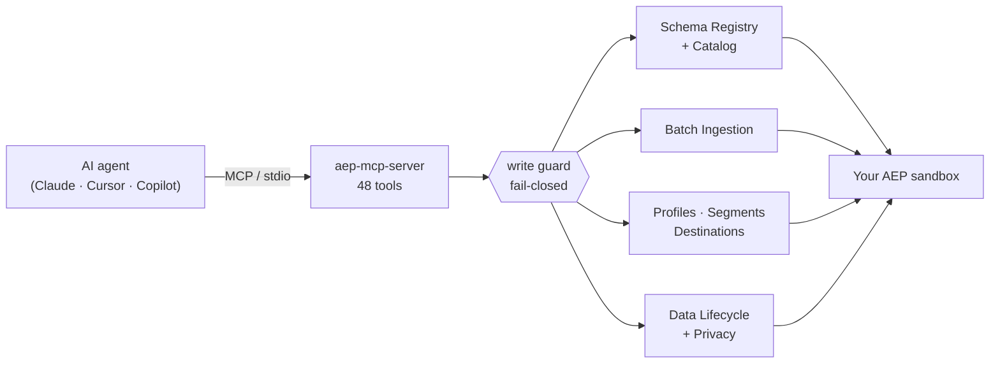
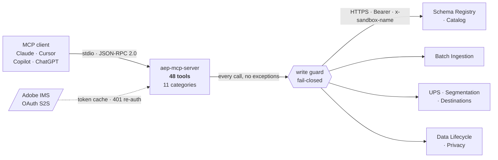

<div align="center">


[](https://www.npmjs.com/package/@focusgts/aep-mcp-server)
[](https://www.npmjs.com/package/@focusgts/aep-mcp-server)
[](https://registry.modelcontextprotocol.io)
[](#-development)
[](LICENSE)

### Adobe's MCP lets your agent *read* Experience Platform. This one lets it **work**.

**48 tools across 11 categories. Full read AND write. Self-hosted, Apache-2.0, no invitation required.**
Batch ingestion, schema composition, audience activation, data lifecycle, privacy jobs, query service.

**Ingest a batch → compose a schema → activate an audience → honour an erasure.**
Every mutation gated by a fail-closed write guard that asks Adobe what kind of sandbox it's in.


</div>

---

## ⚡ Do it in three lines

```bash
claude mcp add aep \
  -e AEP_CLIENT_ID=... -e AEP_CLIENT_SECRET=... \
  -e AEP_ORG_ID=...@AdobeOrg -e AEP_SANDBOX_NAME=your-dev-sandbox \
  -- npx -y @focusgts/aep-mcp-server
```

Then just ask your agent:

> *"Create a schema with the Demographic Details field group, then a dataset on it."*
> *"Ingest this NDJSON file and tell me when the batch lands."*
> *"Build an audience of customers who bought twice this quarter and activate it."*
> *"Delete every record for this email address — dry run first."*

Writes are off until you ask for them, and `safe` mode only unlocks sandboxes **Adobe** classifies as development.

### The loop that makes it different



Adobe's first-party gateway can *tell you* what's in your Experience Platform tenant. It cannot create a dataset, land a batch, activate an audience, or submit an erasure. This does — and does it behind a guard that fails closed.

---

## 🧠 How it works



The agent calls tools; the server talks to live Adobe APIs over OAuth Server-to-Server. **The write guard sits in the HTTP client, not in each tool**, so all 48 inherit it and none can forget it. Blocked calls never reach Adobe.

---

## 🛡️ Safe by default

Three postures. **Reads are never restricted in any mode.**

| `AEP_MODE` | Writes permitted | Use it when |
|---|---|---|
| `read-only` | Never, in any sandbox | Handing the server to someone to explore an environment you don't want touched |
| **`safe`** *(default)* | Only where Adobe classifies the sandbox `development` | Evaluating, or letting an agent work without risking production |
| `production` | Anywhere, including production | You run your own change control and don't want the server second-guessing you |

> **How `safe` decides — and why it's not the sandbox name.**
> A production sandbox can be called anything, and a sandbox called `prod` might not be production. Only Adobe's `type` field from the Sandbox Management API decides.
>
> **It fails closed.** If the type can't be determined — the credential can't read sandbox metadata, the API errors, startup hasn't finished — writes are blocked. A credential must not earn write access by being *less* capable. An unrecognised `AEP_MODE` falls back to `safe`, so a typo can never grant production writes.
>
> **A sandbox literally named `prod` is refused unconditionally**, before mode resolution — so `AEP_MODE=production` does not lift it. Override with `AEP_I_UNDERSTAND_THIS_WRITES_TO_PROD=true` only if that really is your sandbox's name. The inference is deliberately asymmetric: trusting a name to *allow* a write is unsafe, trusting one to *deny* a write is safe, because the worst case is a refusal you can override on purpose.
>
> **Mutations are off entirely** unless `AEP_ALLOW_MUTATIONS=true`. That is separate from `AEP_MODE` on purpose: choosing a write mode should not also mean "yes, you may change my data".

Startup always states the active posture:

```
SAFE MODE — sandbox is a development sandbox, so writes are ENABLED.
SAFE MODE — sandbox is PRODUCTION, so writes are BLOCKED. Reads work normally.
SAFE MODE — sandbox type could not be confirmed, so writes are BLOCKED (fail-closed).
READ-ONLY MODE — no write, update, or delete will be performed in any sandbox.
PRODUCTION MODE — writes permitted against ANY sandbox, including production.
```

### Per-tool confirmation gates

Writes are not *uniformly* gated — uniform gating makes an agent useless. Gates sit where an action is irreversible and wide-reaching, and every one is checked **before any network call**:

| Tool | Gate |
|---|---|
| `aep_create_record_delete` | `dryRun` defaults **true**. Real submission needs `confirm: "DELETE RECORDS <datasetId> <identityDigest>"` — bound to the dataset **and** a SHA-256 digest of the exact identity set, so a confirmation can't be reused for a different deletion. `ALL` and multi-dataset targets are **refused**. |
| `aep_delete_dataset` | `confirm: "DELETE DATASET <id>"`, escalating to `"DELETE PROFILE-ENABLED DATASET <id>"` when the dataset feeds Profile |
| `aep_complete_batch` | `confirm: "COMPLETE BATCH <batchId>"` — the point of no return for ingestion |
| `aep_revert_batch` | `confirm: "REVERT BATCH <batchId>"` |
| `aep_create_dataset_expiration` | `confirm: "CREATE DATASET EXPIRATION <datasetId>"` — unless `dryRun: true` |
| `aep_update_dataset_expiration` | `confirm: "UPDATE DATASET EXPIRATION <ttlId>"` |
| `aep_cancel_dataset_expiration` | `confirm: "CANCEL DATASET EXPIRATION <ttlId>"` |
| `aep_delete_profile` | `confirm: "I understand this is irreversible"` *(deprecated — prefer Data Hygiene)* |

> **Confirmations name their target.** A phrase carrying the dataset id — and for record delete, a hash of the identities too — cannot be copied from one call to another. A generic "I understand this is irreversible" approves *any* deletion once you've typed it once.
>
> **Identity values never leave the process.** `aep_create_record_delete` returns a count, the namespace names, and a digest — never the email addresses or device IDs you passed it. A record-delete request is by nature a list of real people; a tool that echoes them copies them into every transcript and log sink it touches.
>
> Batch creation and file upload are ungated on purpose: those writes are additive and recoverable. An unwanted batch can be left uncompleted, and data that did land can be removed with the Data Hygiene tools.

### Tool annotations

Every tool ships MCP annotations — `readOnlyHint`, `destructiveHint`, `idempotentHint`, `openWorldHint` — derived from the same metadata that builds its description, so the two cannot drift.

| | Count |
|---|---|
| `readOnlyHint: true` | 27 |
| `destructiveHint: true` | 7 |
| Un-annotated | **0** |

These are hints *for the client*, not enforcement — the guards above enforce. Their value is that a client like Claude Desktop uses `destructiveHint` to decide when to interrupt and ask a human. Without them `aep_delete_profile` looks identical to `aep_list_schemas`. A test asserts the destructive list exactly, so an eighth is a deliberate act rather than an oversight.

---

## 🛠️ The 48 tools

All prefixed `aep_`, `verb_noun` naming. 🔒 changes state · 🔥 destructive.

### Data modelling & ingestion

<table>
<tr><td valign="top" width="33%">

**Schemas** (4)
- `list_schemas`
- `get_schema`
- `create_schema` 🔒
- `update_schema` 🔒

**Datasets** (4)
- `list_datasets`
- `get_dataset`
- `create_dataset` 🔒
- `delete_dataset` 🔥

</td><td valign="top" width="33%">

**Ingestion** (7)
- `create_batch` 🔒
- `upload_batch_file` 🔒
- `complete_batch` 🔥
- `get_batch_status`
- `list_batches`
- `abort_batch` 🔥
- `revert_batch` 🔥

</td><td valign="top" width="33%">

**Sources** (2)
- `list_sources`
- `list_dataflows`

**Query Service** (3)
- `run_query` 🔒
- `get_query_status`
- `list_queries`

</td></tr>
</table>

### Profiles, audiences & activation

<table>
<tr><td valign="top" width="33%">

**Identities** (2)
- `list_identity_namespaces`
- `get_identity_graph`

</td><td valign="top" width="33%">

**Profiles** (4)
- `get_profile`
- `get_profile_by_identity`
- `preview_profile`
- `delete_profile` 🔥

</td><td valign="top" width="33%">

**Segments** (4)
- `list_segments`
- `get_segment`
- `create_segment` 🔒
- `estimate_segment_size`

**Destinations** (3)
- `list_destinations`
- `create_destination_connection` 🔒
- `activate_segment` 🔒

</td></tr>
</table>

### Governance — privacy, lifecycle & event routing

<table>
<tr><td valign="top" width="33%">

**Privacy Service** (6)
- `create_privacy_job` 🔒
- `get_privacy_job`
- `list_privacy_jobs`
- `cancel_privacy_job` 🔒
- `get_privacy_job_results`
- `list_privacy_namespaces`

</td><td valign="top" width="33%">

**Data Hygiene** (9)
- `create_record_delete` 🔥
- `get_work_order_status`
- `list_work_orders`
- `get_data_lifecycle_quota`
- `create_dataset_expiration` 🔥
- `get_dataset_expiration`
- `list_dataset_expirations`
- `update_dataset_expiration` 🔥
- `cancel_dataset_expiration` 🔥

</td></tr>
</table>

> **Workflows these unlock**
>
> **Ingest end to end** — `create_schema` → `create_dataset` → `create_batch` → `upload_batch_file` → `complete_batch` → `get_batch_status`
>
> **Build and activate an audience** — `create_segment` → `estimate_segment_size` → `list_destinations` → `create_destination_connection` → `activate_segment`
>
> **Honour an erasure request** — `get_profile_by_identity` → `create_record_delete` → `get_work_order_status`
>
> **Retire data on a schedule** — `create_dataset_expiration` → `list_dataset_expirations` → `update_dataset_expiration` → `cancel_dataset_expiration`

**What's actually been run against a live tenant** is recorded per tool in [`docs/VALIDATION-MATRIX.md`](./docs/VALIDATION-MATRIX.md) — including the surfaces that are documented-and-mocked but deliberately never executed, and why.

---

## 🥊 vs Adobe's first-party Experience Platform tools

Adobe ships first-party tools through [CX Coworker Gateway](https://experienceleague.adobe.com/en/docs/cx-enterprise-ai/experience-cloud-ai/mcp/overview). It's a genuinely good product, and if all you need is to *ask questions about* your tenant, use it.

| | Adobe AEP tools (CX Coworker Gateway) | @focusgts/aep-mcp-server |
|---|---|---|
| Operations | **Read-only** (`search_*`) | **Full CRUD** (read + write) |
| Tool count | 8 | **48** |
| Access | **Invitation-only** + org enablement | `npm install` — any org with API credentials |
| Batch ingestion | Not available | **7 tools** |
| Profiles / Identity | Not covered | **6 tools** |
| Privacy Service | Not covered | **6 tools** |
| Data Lifecycle | Not covered | **9 tools** |
| Transport | Adobe-hosted gateway | stdio (local, composes with other MCPs) |
| Data path | Queries traverse Adobe's gateway | Runs entirely in your own VPC |
| License | Proprietary | **Apache 2.0** |
| Error responses | — | Structured `AEP_{status}` codes |

Audiences and destinations do appear, but in a *separate* Real-Time CDP tool set on the same gateway — and Adobe is explicit that creating, activating, updating, or deleting audiences, destinations, and dataflows isn't supported there either. The read-only boundary holds across the whole gateway.

**They're complementary, not competing: pair Adobe's gateway for governed reads with this server for the write path.**

> Adobe's figures were read from [their Experience Platform tools page](https://experienceleague.adobe.com/en/docs/cx-enterprise-ai/experience-cloud-ai/mcp/mcp-product-tools/aep-mcp) (last updated 17 July 2026): `search_datasets`, `search_class_relations`, `search_data_access`, `search_data_lake`, `search_dule`, `search_query_service`, `search_audit`, `search_allowed_ip_ranges`. It's a Beta surface and will change — check their docs for the current figure. **The read/write split is the durable difference, not the count.**

---

## 🔌 Add it to your tool

<details open>
<summary><b>Claude Code</b> — one command</summary>

```bash
claude mcp add aep \
  -e AEP_CLIENT_ID=... -e AEP_CLIENT_SECRET=... \
  -e AEP_ORG_ID=...@AdobeOrg -e AEP_SANDBOX_NAME=your-dev-sandbox \
  -- npx -y @focusgts/aep-mcp-server
```
</details>

<details>
<summary><b>Claude Desktop</b> — <code>claude_desktop_config.json</code></summary>

`~/Library/Application Support/Claude/claude_desktop_config.json` (macOS) or `%APPDATA%\Claude\claude_desktop_config.json` (Windows):

```json
{
  "mcpServers": {
    "aep": {
      "command": "npx",
      "args": ["-y", "@focusgts/aep-mcp-server"],
      "env": {
        "AEP_CLIENT_ID": "...",
        "AEP_CLIENT_SECRET": "...",
        "AEP_ORG_ID": "...@AdobeOrg",
        "AEP_SANDBOX_NAME": "your-dev-sandbox"
      }
    }
  }
}
```
</details>

<details>
<summary><b>Cursor</b> — <code>.cursor/mcp.json</code></summary>

```json
{
  "mcpServers": {
    "aep": {
      "command": "npx",
      "args": ["-y", "@focusgts/aep-mcp-server"],
      "env": {
        "AEP_CLIENT_ID": "...",
        "AEP_CLIENT_SECRET": "...",
        "AEP_ORG_ID": "...@AdobeOrg",
        "AEP_SANDBOX_NAME": "your-dev-sandbox"
      }
    }
  }
}
```
</details>

<details>
<summary><b>VS Code (GitHub Copilot)</b> — <code>.vscode/mcp.json</code></summary>

```json
{
  "servers": {
    "aep": {
      "command": "npx",
      "args": ["-y", "@focusgts/aep-mcp-server"],
      "env": {
        "AEP_CLIENT_ID": "...",
        "AEP_CLIENT_SECRET": "...",
        "AEP_ORG_ID": "...@AdobeOrg",
        "AEP_SANDBOX_NAME": "your-dev-sandbox"
      }
    }
  }
}
```
</details>

---

## 🔐 Credentials

Get them at [developer.adobe.com/console](https://developer.adobe.com/console): create a project → add **Experience Platform API** → **OAuth Server-to-Server**.

| Variable | Required | Description |
|---|---|---|
| `AEP_CLIENT_ID` | **Yes** | Adobe I/O client ID |
| `AEP_CLIENT_SECRET` | **Yes** | Adobe I/O client secret |
| `AEP_ORG_ID` | **Yes** | IMS org ID — must end `@AdobeOrg` |
| `AEP_SANDBOX_NAME` | **Yes** | Sandbox to scope every call to. **No default** — see below |
| `AEP_ALLOW_MUTATIONS` | No | `true` to permit any write at all. Off by default |
| `AEP_MODE` | No | `read-only` · `safe` *(default)* · `production` |
| `AEP_I_UNDERSTAND_THIS_WRITES_TO_PROD` | No | Only if your sandbox is genuinely *named* `prod` |
| `AEP_LOG_RESPONSE_BODIES` | No | Log raw Adobe error bodies. Off by default — Adobe echoes request context, which can include identity values |
| `LOG_LEVEL` | No | Pino level (default `info`) |
| `AEP_REQUEST_TIMEOUT_MS` | No | Per-request timeout (default `30000`) |
| `AEP_MAX_RETRIES` | No | Retries on 429/5xx (default `3`) |

> **`AEP_SANDBOX_NAME` has no default, deliberately.** It used to fall back to `prod`, which meant a config file missing one line silently pointed every request — reads included — at production, with no warning. There is no safe default: a wrong guess is indistinguishable from a correct one until something is read or written in the wrong environment. Setting it explicitly to `prod` is allowed; that's a visible, deliberate choice, and mutations there are still refused by the write guard.
>
> **Sandbox scoping.** Every tool sends `x-sandbox-name`, and Query Service derives its database as `<AEP_SANDBOX_NAME>:all`.

---

## 🧾 Entitlements

Not every Adobe org licenses every AEP product. A tool returning `AEP_403` usually means a missing entitlement rather than a bad credential.

| Category | Required entitlement |
|---|---|
| Schemas · Datasets · Ingestion | AEP (base) |
| Identities | AEP (base) + Identity Service |
| Profiles · Segments · Destinations | Real-Time CDP |
| Sources | AEP (base) — connector availability varies by SKU |
| Query Service | AEP Query Service add-on |
| Privacy Service | Adobe Privacy Service (sold separately) |
| Data Hygiene | AEP (base). Adobe documents **no** Data Distiller gate here — an earlier version of this table wrongly claimed one. A `401` means wrong org, wrong sandbox, or wrong credential profile, in that order |

---

## 🏗️ Architecture

TypeScript `strict` end-to-end, `@modelcontextprotocol/sdk` + `zod`, stdio transport, stateless per request.



OAuth Server-to-Server with a deduped token cache, structured pino logging with PII redaction, exponential-backoff retries, automatic 401 re-auth, working cursor pagination, structured `AEP_{status}` error codes, and a graceful-shutdown lifecycle. All logs go to **stderr** — stdout is reserved for the MCP JSON-RPC stream.

---

## 🧪 Development

```bash
git clone https://github.com/Focus-GTS/aep-mcp-server.git
cd aep-mcp-server && npm install && npm run build && npm test
```

```bash
npm run dev          # tsx src/server.ts (hot-reload)
npm test             # vitest — 392 tests
npm run typecheck    # tsc --noEmit
npm run tools        # print the registered tool surface
```

`npm run test:live` runs a read-only smoke suite against a real IMS org and sandbox to verify credentials, entitlements, and sandbox scoping end to end. It invokes **no** destructive tool and requires `AEP_SANDBOX_NAME` to point at a non-production sandbox.

---

## 🧩 Part of the Focus GTS Adobe suite

| | |
|---|---|
| [eds-mcp-server](https://github.com/Focus-GTS/eds-mcp-server) | MCP server for Adobe Edge Delivery Services — read, audit, fix, publish and undo your site |
| [eds-content-ops-skills](https://github.com/Focus-GTS/eds-content-ops-skills) | AI skills for EDS content ops — first third-party contributor merged into [Adobe's official skills repo](https://github.com/adobe/skills) |
| [eds-ops](https://github.com/Focus-GTS/eds-ops) | CLI + GitHub Action for automated site grading and PR gating |
| [EDS Score](https://www.focusgts.com/eds-score/) | Free browser-based site health analyzer |

---

<div align="center">

Built by **[Focus GTS](https://focusgts.com)** — Adobe Silver Solution Partner · Apache-2.0
<br/>Bug reports and PRs welcome at [Focus-GTS/aep-mcp-server](https://github.com/Focus-GTS/aep-mcp-server/issues) · <dfox@focusgts.com>
<br/>Not affiliated with or endorsed by Adobe Inc. or Anthropic, PBC.

</div>
